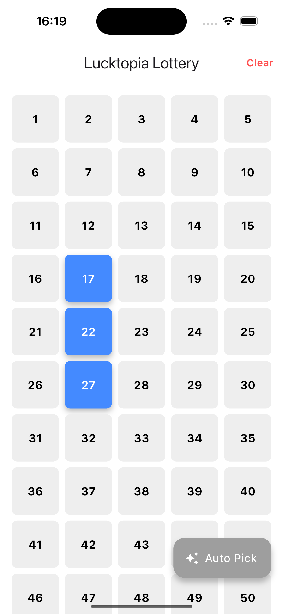
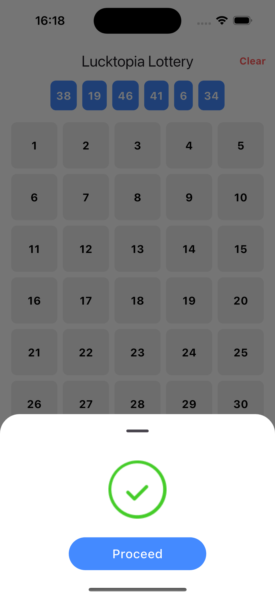

# 🎰 Lucktopia Lottery Number Picker 🎰

A Flutter mobile app for the **Lucktopia mobile lottery app** that allows users to either manually select their lottery numbers or let the system auto-generate them using a Random Number Generator (RNG). Built following modern Flutter architecture best practices with **Riverpod** and **ViewModel separation**.

---

## 📱 Features

### 🎛 Manual Pick Mode:
- Displays a **grid of numbers from 1 to 50**
- Users can **tap to select exactly 6 numbers**
- Highlights selected numbers
- Prevents selecting more than 6 numbers
- “Proceed” button appears only when 6 numbers are selected
- Confetti celebration effect when 6 numbers are picked 🎉

---

### 🔀 Auto Pick Mode:
- Generates **6 unique random numbers between 1 and 50**
- Displays generated numbers in a styled container
- Animated number shuffling effect before final selection
- “Proceed” button appears when auto pick completes
- Confetti celebration included for a nice user touch 🎉

---

### ✨ Extras:
- **Clear** button to reset picks
- Smooth animations for number selection and auto-pick RNG
- Clean state management using **Riverpod StateNotifier**
- ConfettiController logic managed cleanly in ViewModel

---

## 🛠️ Setup Instructions

1. **Clone the repository**

   ```bash
   git clone https://github.com/yourusername/lucktopia-lottery-picker.git](https://github.com/ayubasalami/Lucktopia-Lottery-Number-Picker
   cd lucktopia-lottery-picker


## 📸 Screenshots

### Manual Number Selection


### Auto Pick Mode



